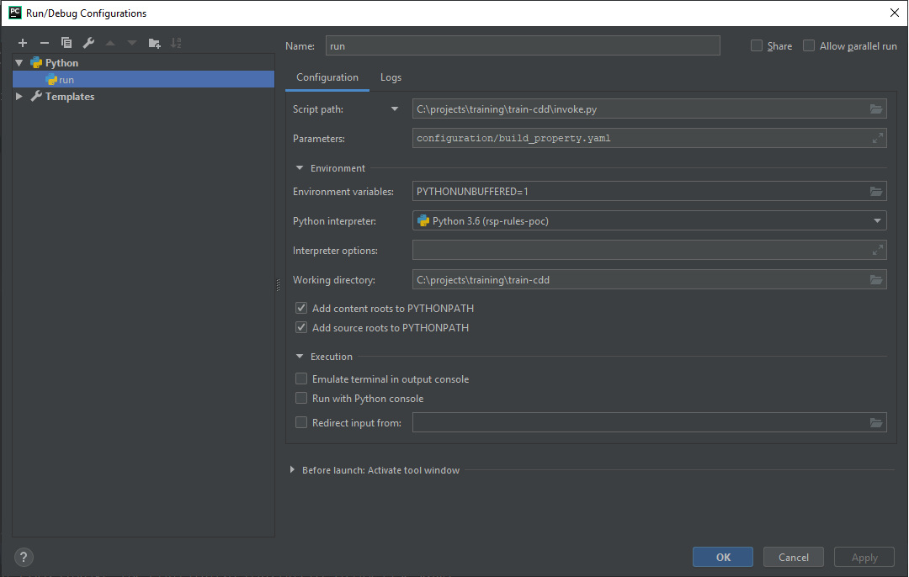

# Configuration Driven Design
This is the code project to support Configuration Driven Design training.

1. To run on your machine please create a python run configuration in your PyCharm editor and configure it as follows:

        

2. Hit Play (Run)

## Important Note

Modify the file path according to the location you have installed the project at on your machine